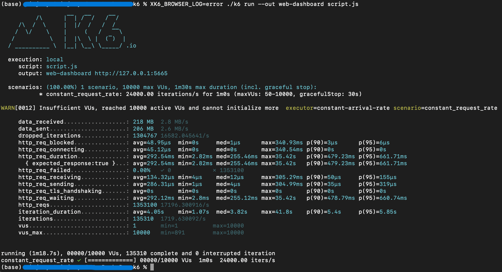
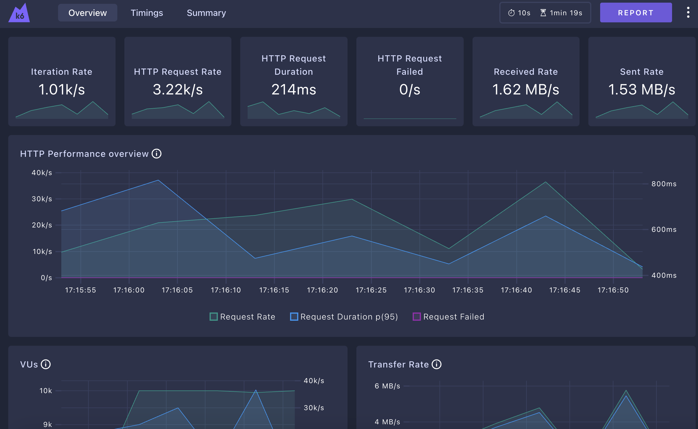

# Dcard Backend Intern Assignment 2024

## Requirements

- [x] Admin API (GET /api/vi/ad)
- [x] 投放 API (POST /api/vi/ad)
- [x] 請撰寫適當的 test
- [x] 提供 Public API 能超過 10,000 Requests Per Second 的設計
- [x] 同時存在系統的總活躍廣告數量 (也就是 StartAt < NOW < EndAt) < 1000
- [x] 每天 create 的廣告數量 不會超過 3000 個

## Environment

- Go 1.20.1
- MySQL 8
- Nginx
- Redis 7.2.4
- Grafana K6
- grafana/xk6-dashboard

## Usage

```
// build docker containers
$ make

// enter server container
$ docker exec -it <server_container> bash

// edit config.json
$ cp config.json.example config.json
$ vim config.json

// create schema
$ cd command/create/schema && go run create_schema.go

// run server
$ make migrate-up
$ go run main.go
```

## Assignment Idea

### 請對這兩組 API 進行合理的參數驗證和錯誤處理

### 請撰寫適當的 test

我在這裡分別寫了以下測試對應 assignment 內的注意事項
- 廣告列表測試(TestGetAdvertistmentList, TestGetAdvertistmentListNotActive)
- 新增廣告測試(TestCreateAdvertistment)
- 每日新增廣告測試(TestMaxAdEveryday)
- 總活耀廣告測試(TestMaxActiveAd)

### 提供 Public API 能超過 10,000 Requests Per Second 的設計




- 這邊使用 Redis 來對廣告列表進行緩存，每次的請求我會將每個 Query 當作參數作為 Redis 的 Key， Value 為搜尋結果

- 在負載測試中，我使用 Grafana K6 來對 8000 port 上的 API Server 進行負載測試，模擬使用者使用不同的 Parameters 來發送 Http request 獲取廣告列表，結果為可承受 10000 以上的 RPS

###  同時存在系統的總活躍廣告數量 (也就是 StartAt < NOW < EndAt) < 1000

```sql
SELECT count(*) FROM `advertistments` WHERE ('2024-05-19 03:00:00' between start_at and end_at) and ('2024-05-20 16:00:00' between start_at and end_at)
```

- 使用上述 SQL 計算活耀廣告數量

###  每天 create 的廣告數量不會超過 3000 個

- 計算 created_at 屬於今天的的廣告數是否為 3000 以上